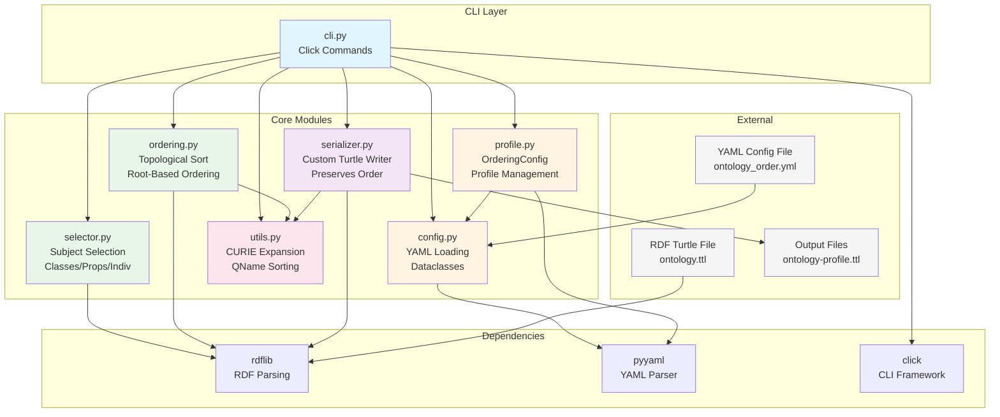
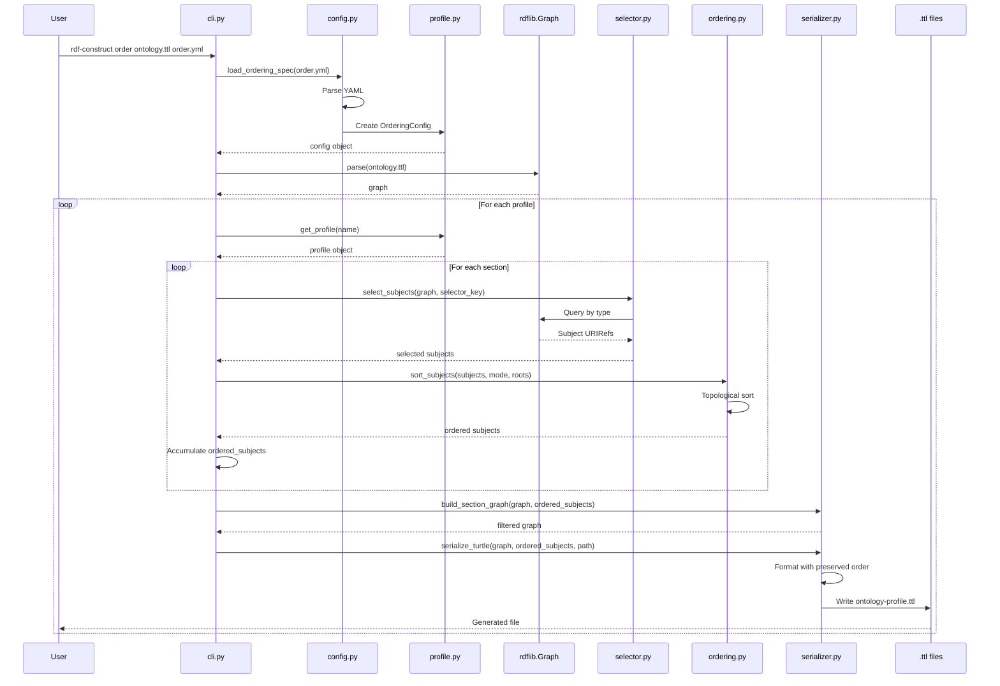
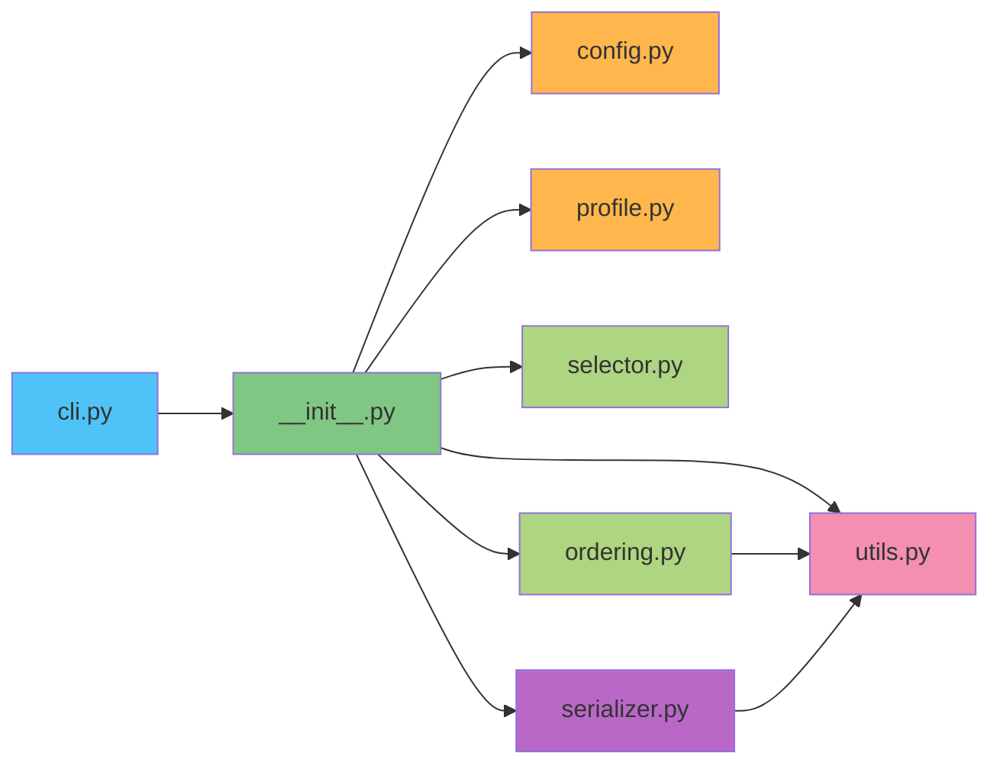
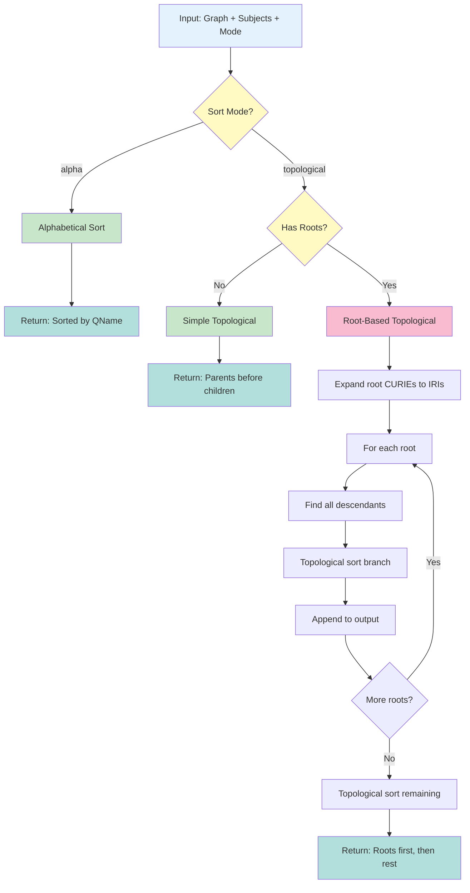
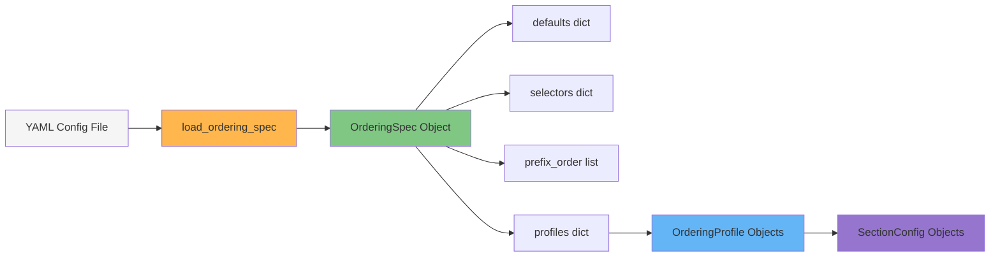

# rdf-construct Architecture

## System Architecture Diagram

## Data Flow: Order Command

## Module Dependencies

## Ordering Algorithm Flow

## Refactoring Map

```mermaid
graph TB
    subgraph "Original: order_turtle.py (325 lines)"
        ORIG[Monolithic Script]
        ORIG_YAML[YAML helpers]
        ORIG_CURIE[CURIE/prefix helpers]
        ORIG_SELECT[Selection logic]
        ORIG_ORDER[Ordering algorithms]
        ORIG_SERIAL[Serialization]
        ORIG_MAIN[Main/CLI]
        
        ORIG --> ORIG_YAML
        ORIG --> ORIG_CURIE
        ORIG --> ORIG_SELECT
        ORIG --> ORIG_ORDER
        ORIG --> ORIG_SERIAL
        ORIG --> ORIG_MAIN
    end
    
    subgraph "Refactored: rdf-construct package (~1000 lines)"
        NEW_PKG[Package Structure]
        NEW_CONFIG[config.py<br/>193 lines]
        NEW_PROFILE[profile.py<br/>111 lines]
        NEW_UTILS[utils.py<br/>90 lines]
        NEW_SELECTOR[selector.py<br/>65 lines]
        NEW_ORDERING[ordering.py<br/>220 lines]
        NEW_SERIALIZER[serializer.py<br/>168 lines]
        NEW_CLI[cli.py<br/>174 lines]
        
        NEW_PKG --> NEW_CONFIG
        NEW_PKG --> NEW_PROFILE
        NEW_PKG --> NEW_UTILS
        NEW_PKG --> NEW_SELECTOR
        NEW_PKG --> NEW_ORDERING
        NEW_PKG --> NEW_SERIALIZER
        NEW_PKG --> NEW_CLI
    end
    
    ORIG_YAML -.->|Refactored to| NEW_CONFIG
    ORIG_YAML -.->|Refactored to| NEW_PROFILE
    ORIG_CURIE -.->|Refactored to| NEW_UTILS
    ORIG_SELECT -.->|Refactored to| NEW_SELECTOR
    ORIG_ORDER -.->|Refactored to| NEW_ORDERING
    ORIG_SERIAL -.->|Refactored to| NEW_SERIALIZER
    ORIG_MAIN -.->|Refactored to| NEW_CLI
    
    style ORIG fill:#ffebee
    style NEW_PKG fill:#e8f5e9
    style NEW_CONFIG fill:#fff9c4
    style NEW_PROFILE fill:#fff9c4
    style NEW_UTILS fill:#f8bbd0
    style NEW_SELECTOR fill:#c8e6c9
    style NEW_ORDERING fill:#c8e6c9
    style NEW_SERIALIZER fill:#e1bee7
    style NEW_CLI fill:#bbdefb
```

## Configuration Processing

## Key Insights

### Module Responsibilities

1. **config.py / profile.py** - Configuration management
   - Parse YAML into typed Python objects
   - Validate structure
   - Provide access to profiles

2. **selector.py** - Subject identification
   - Query graph for specific types
   - Handle both owl:Class and rdfs:Class
   - Identify individuals (non-classes, non-properties)

3. **ordering.py** - Sorting algorithms
   - Topological sort (Kahn's algorithm)
   - Root-based branch ordering
   - Alphabetical fallback

4. **serializer.py** - Custom output
   - **Critical**: Preserves subject order
   - Formats as valid Turtle
   - Orders predicates (rdf:type first)

5. **utils.py** - Supporting functions
   - CURIE expansion
   - QName sorting keys
   - Prefix rebinding

6. **cli.py** - User interface
   - Command definitions
   - Argument parsing
   - Progress messages

### Data Flow Summary

1. User invokes CLI command
2. YAML config loaded and parsed into dataclasses
3. RDF graph parsed by rdflib
4. For each profile:
   - For each section:
     - Select subjects by type
     - Sort subjects by mode
     - Accumulate ordered list
   - Build filtered graph
   - Serialize with preserved order
5. Output written to file

### Critical Differences from rdflib

**rdflib's default behavior:**
- Always sorts subjects alphabetically
- Loses semantic structure
- Makes diffs noisy

**Our custom serializer:**
- Respects exact subject order provided
- Preserves hierarchy in output
- Makes RDF files human-readable

This is why `serializer.py` is essential - rdflib cannot do what we need.