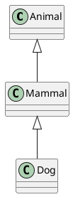

# PlantUML Styling and Layout Guide

## Overview

The rdf-construct UML module now supports comprehensive styling and layout control through YAML configuration files. This allows you to:

1. **Define color schemes** for different entity types
2. **Control diagram layout** (direction, spacing, grouping)
3. **Apply stereotypes** to show semantic roles
4. **Customize arrow styles** for different relationships
5. **Create reusable visual themes** for different audiences

## Architecture

The styling system is separated into two independent concerns:

```
uml_styles.yml    → Visual appearance (colors, stereotypes, arrows)
uml_layouts.yml   → Spatial arrangement (direction, spacing, grouping)
```

Both are loaded and applied independently, allowing you to mix and match:
- **Default style + Hierarchy layout**
- **High contrast style + Compact layout**
- **Grayscale style + Documentation layout**
- etc.

## Configuration Files

### 1. Style Configuration (`uml_styles.yml`)

Defines visual appearance through **style schemes**:

```yaml
schemes:
  my_scheme:
    description: "My custom color scheme"
    
    classes:
      default:  # Fallback for all classes
        border: "#0066CC"
        fill: "#E8F4F8"
        line_style: bold
      
      by_namespace:  # Color by vocabulary/namespace
        ies:
          border: "#0066CC"
          fill: "#E8F4F8"
        ex:
          border: "#2E7D32"
          fill: "#E8F5E9"
      
      by_type:  # Special coloring for metaclasses, etc.
        meta_class:
          border: "#CC0000"
          fill: "#FFE6E6"
          line_style: bold
    
    instances:
      border: "#000000"
      fill: "#000000"
      text: "#FFFFFF"
      inherit_class_border: true  # Use parent class border color
    
    arrows:
      subclass:  # rdfs:subClassOf relationships
        color: "#0066CC"
        style: bold
      
      rdf_type:  # rdf:type (instance-to-class)
        color: "#D32F2F"
        style: bold
      
      object_property:  # Object properties
        color: "#000000"
        style: normal
    
    show_stereotypes: true  # Display UML stereotypes
    stereotype_map:
      ies:ClassOfElement: "«meta»"
      owl:Class: "«class»"
```

### 2. Layout Configuration (`uml_layouts.yml`)

Controls spatial arrangement:

```yaml
layouts:
  hierarchy:
    description: "Top-down with parents above children"
    direction: top_to_bottom      # or bottom_to_top, left_to_right, right_to_left
    arrow_direction: up            # Children point UP to parents
    hide_empty_members: false
    show_arrows: true
    group_by_namespace: false
    spacing:
      classMarginTop: 10
      classMarginBottom: 10
```

## Color Specification

Colors can be specified as:
- **Hex codes**: `"#0066CC"`
- **PlantUML color names**: `"Blue"`, `"LightBlue"`, etc.

The `ColorPalette` class converts these to PlantUML color directives:

```python
palette = ColorPalette({
    "border": "#0066CC",
    "fill": "#E8F4F8",
    "line_style": "bold"
})

# Generates: #E8F4F8;line:#0066CC;line.bold
plantuml_color = palette.to_plantuml()
```

## Arrow Direction Control

### Why Arrow Direction Matters

In PlantUML, specifying arrow direction influences layout. For class hierarchies, we typically want:

- **Parents ABOVE children** (top-down hierarchy)
- **Children point UP to parents** (`-up->`)

This creates natural visual hierarchy:



Result: Dog at bottom, Animal at top.

### Configuration

```yaml
layouts:
  hierarchy:
    direction: top_to_bottom
    arrow_direction: up  # Children point up to parents
```

This generates arrows like:
- `Dog -up-|> Mammal` (Dog points UP to Mammal)
- `Mammal -up-|> Animal` (Mammal points UP to Animal)

### Available Arrow Directions

- `up` - Point upward (for top-down hierarchies)
- `down` - Point downward (for bottom-up hierarchies)
- `left` - Point left (for right-to-left flows)
- `right` - Point right (for left-to-right flows)

## Stereotypes

Stereotypes show the semantic role of classes:

```plantuml
class "ies:ClassOfElement" «meta» #FFE6E6 {
}
```

### Enabling Stereotypes

```yaml
schemes:
  my_scheme:
    show_stereotypes: true
    stereotype_map:
      ies:ClassOfElement: "«meta»"
      ies:RepresentationClass: "«representation»"
      owl:Class: "«class»"
```

The renderer checks each class's RDF type and applies the matching stereotype.

## Complete Example

### 1. Define Your Styles (`uml_styles.yml`)

```yaml
schemes:
  ies_semantic:
    description: "IES ontology with semantic role coloring"
    
    classes:
      by_namespace:
        ies:
          border: "#0066CC"
          fill: "#E8F4F8"
          line_style: bold
      
      by_type:
        meta_class:
          border: "#CC0000"
          fill: "#FFE6E6"
    
    instances:
      border: "#000000"
      fill: "#000000"
      text: "#FFFFFF"
    
    arrows:
      subclass:
        color: "#0066CC"
        style: bold
      rdf_type:
        color: "#D32F2F"
    
    show_stereotypes: true
    stereotype_map:
      ies:ClassOfElement: "«meta»"
```

### 2. Define Your Layout (`uml_layouts.yml`)

```yaml
layouts:
  hierarchy:
    description: "Top-down with parents above"
    direction: top_to_bottom
    arrow_direction: up
    hide_empty_members: false
```

### 3. Generate Diagram

```python
from rdflib import Graph
from uml_style import load_style_config
from uml_layout import load_layout_config
from renderer import render_plantuml
from rdf_construct.uml.mapper import collect_diagram_entities
from rdf_construct.uml.context import load_uml_config

# Load ontology
graph = Graph()
graph.parse("ontology.ttl", format="turtle")

# Load configurations
uml_config = load_uml_config("uml_contexts.yml")
style_config = load_style_config("uml_styles.yml")
layout_config = load_layout_config("uml_layouts.yml")

# Get specific configurations
context = uml_config.get_context("my_context")
style = style_config.get_scheme("ies_semantic")
layout = layout_config.get_layout("hierarchy")

# Select entities
entities = collect_diagram_entities(graph, context, {})

# Render with style and layout
render_plantuml(graph, entities, "output.puml", style, layout)
```

## Predefined Style Schemes

### `default`
Professional blue color scheme suitable for general use.

### `ies_semantic`
Specialized for IES ontology with:
- Blue for regular classes
- Red for meta-level classes
- Stereotypes enabled

### `high_contrast`
Bold colors for presentations:
- Black borders
- Bright fills (yellow, green, blue)
- Thick arrows

### `grayscale`
For academic papers:
- Black and white only
- Different grey shades by namespace
- Stereotypes enabled

### `minimal`
Bare-bones for debugging:
- Black borders
- White fills
- No special styling

## Predefined Layouts

### `hierarchy`
Top-down with parents above children. Best for class hierarchies.

### `flat`
Left-to-right for network-style diagrams.

### `compact`
Minimal spacing, hides empty classes.

### `documentation`
Groups by namespace, moderate spacing.

### `presentation`
Large spacing for slides and projectors.

### `network`
Left-to-right emphasizing relationships.

## Advanced Usage

### Creating Custom Color Palettes

Use YAML anchors for reusable colors:

```yaml
colors:
  my_blue: &my_blue "#0066CC"
  my_red: &my_red "#CC0000"

schemes:
  my_scheme:
    classes:
      by_namespace:
        ies:
          border: *my_blue
          fill: "#E8F4F8"
        ex:
          border: *my_red
          fill: "#FFE6E6"
```

### Type-Based Styling

Style specific RDF types specially:

```yaml
schemes:
  my_scheme:
    classes:
      by_type:
        meta_class:  # Custom key
          border: "#CC0000"
          fill: "#FFE6E6"
```

Then in code, map this to RDF types:
```python
# In uml_style.py, enhance get_class_style() to check:
# if (cls, RDF.type, IES.ClassOfElement) in graph:
#     return self.class_styles.get("type:meta_class")
```

### Instance Border Inheritance

Make instances inherit border color from their class:

```yaml
schemes:
  my_scheme:
    instances:
      border: "#000000"
      fill: "#000000"
      text: "#FFFFFF"
      inherit_class_border: true  # Inherit from parent class
```

This helps visually group instances with their classes.

## Integration with CLI

To integrate with the rdf-construct CLI:

```bash
# Future CLI syntax
rdf-construct uml ontology.ttl \
  --context contexts.yml:my_context \
  --style styles.yml:default \
  --layout layouts.yml:hierarchy \
  --output diagram.puml
```

## Best Practices

### 1. Separate Concerns
Keep styles and layouts in separate files. This allows:
- Mix and match combinations
- Maintain styles independently
- Share layouts across projects

### 2. Use Semantic Names
Name schemes and layouts semantically:
- ✓ `ies_semantic`, `academic`, `presentation`
- ✗ `style1`, `blue_style`, `layout_a`

### 3. Document Your Schemes
Always include descriptions:
```yaml
schemes:
  my_scheme:
    description: "High contrast for presentations on projectors"
```

### 4. Test Combinations
Not all style/layout combinations work well together:
- High contrast + Compact = Good for quick overviews
- Grayscale + Documentation = Good for papers
- Minimal + Presentation = Might look too plain

### 5. Version Your Configs
Commit your YAML files to version control alongside ontologies.

## Troubleshooting

### Colors Not Showing
- Check PlantUML syntax with online editor
- Verify hex codes are valid
- Some PlantUML renderers don't support all features

### Layout Not As Expected
- PlantUML's layout engine has heuristics
- Arrow direction hints don't guarantee exact placement
- Try different spacing values

### Stereotypes Not Appearing
- Ensure `show_stereotypes: true`
- Check `stereotype_map` has correct RDF type CURIEs
- Verify classes actually have those RDF types

## Next Steps

1. **Try the examples**: Run `example_styled_uml.py`
2. **Create your own schemes**: Edit `uml_styles.yml`
3. **Experiment with layouts**: Try different arrow directions
4. **Integrate with CLI**: Update CLI to accept style/layout params
5. **Add more schemes**: Create domain-specific color palettes

## References

- PlantUML class diagram docs: https://plantuml.com/class-diagram
- PlantUML colors: https://plantuml.com/color
- PlantUML skinparam: https://plantuml-documentation.readthedocs.io/en/latest/formatting/all-skin-params.html