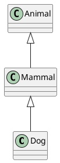

# UML Styling & Layout Implementation Summary

## What Was Built

Complete styling and layout system for PlantUML class diagram generation with:

1. **Style Configuration Module** (`uml_style.py`)
   - Color palettes for classes, instances, and arrows
   - Stereotype support for semantic labeling
   - Namespace-based and type-based coloring
   - 5 predefined color schemes

2. **Layout Configuration Module** (`uml_layout.py`)
   - Direction control (top-down, bottom-up, left-right, right-left)
   - Arrow direction hints for hierarchy visualization
   - Spacing and grouping options
   - 6 predefined layouts

3. **Enhanced Renderer** (`renderer.py`)
   - Applies styles and layouts to PlantUML output
   - Supports all existing features (classes, properties, instances)
   - Backward compatible (styles/layouts optional)

4. **Configuration Files**
   - `uml_styles.yml` - 5 ready-to-use color schemes
   - `uml_layouts.yml` - 6 layout configurations
   - Examples with full documentation

5. **Documentation**
   - Comprehensive styling guide
   - Usage examples
   - Best practices

## Key Features

### 1. Top-Down Hierarchy Control ✓

**Your requirement**: "I prefer a top-down layout for class diagrams, i.e. super-classes and super-properties appear above their sub-classes and sub-properties."

**Solution**:
```yaml
layouts:
  hierarchy:
    direction: top_to_bottom
    arrow_direction: up  # Children point UP to parents
```

This generates PlantUML like:


Result: Animal at top, Dog at bottom.

### 2. Color Profiles by Class Type ✓

**Your requirement**: "Specify 'colour profiles' [...] based on class type and all sub-classes of that type should inherit the colour palette."

**Solution**:
```yaml
schemes:
  my_scheme:
    classes:
      by_namespace:  # Color all classes in a namespace
        ies:
          border: "#0066CC"
          fill: "#E8F4F8"
      
      by_type:  # Special colors for metaclasses
        meta_class:
          border: "#CC0000"
          fill: "#FFE6E6"
```

Classes inherit colors from:
1. Explicit type mapping (for metaclasses)
2. Their namespace prefix
3. Default class style

### 3. Instance Styling ✓

**Your requirements**:
- Class border colour ✓
- Class infill colour ✓
- Instance border colour ✓
- Instance infill colour ✓
- `rdf:type` arrows ✓

**Solution**:
```yaml
schemes:
  my_scheme:
    classes:
      default:
        border: "#0066CC"
        fill: "#E8F4F8"
    
    instances:
      border: "#000000"
      fill: "#000000"
      text: "#FFFFFF"
      inherit_class_border: true  # Use parent class border
    
    arrows:
      rdf_type:  # Styled separately
        color: "#D32F2F"  # Red
        style: bold
```

### 4. Stereotypes ✓

**Your requirement**: "Ability to display UML stereotype on classes in class diagrams"

**Solution**:
```yaml
schemes:
  my_scheme:
    show_stereotypes: true
    stereotype_map:
      ies:ClassOfElement: "«meta»"
      owl:Class: "«class»"
```

Output:
```plantuml
class "ies:ClassOfElement" «meta» #FFE6E6 {
}
```

### 5. YAML Configuration ✓

**Your requirement**: "Use yaml files for controlling configurable parameters and features"

**Solution**: Two separate YAML files:
- `uml_styles.yml` - Visual appearance
- `uml_layouts.yml` - Spatial arrangement

This separation allows mix-and-match combinations.

## File Structure

```
rdf-construct/
├── src/rdf_construct/uml/
│   ├── style.py           # Style configuration module
│   ├── layout.py          # Layout configuration module
│   └── renderer.py        # Enhanced renderer (update existing)
├── examples/
│   ├── uml_styles.yml     # Style definitions
│   ├── uml_layouts.yml    # Layout definitions
│   └── example_styled_uml.py  # Usage example
└── docs/
    ├── UML_STYLING_GUIDE.md   # Complete documentation
    └── STYLING_SUMMARY.md     # This file
```

## Predefined Schemes

### Style Schemes (in `uml_styles.yml`)

1. **`default`** - Professional blue scheme for general use
2. **`ies_semantic`** - IES-specific with meta-level coloring
3. **`high_contrast`** - Bold colors for presentations
4. **`grayscale`** - Black/white for academic papers
5. **`minimal`** - Bare-bones for debugging

### Layout Configurations (in `uml_layouts.yml`)

1. **`hierarchy`** - Top-down with parents above (your preferred layout)
2. **`flat`** - Left-to-right for networks
3. **`compact`** - Minimal spacing, hides empty classes
4. **`documentation`** - Grouped by namespace
5. **`presentation`** - Large spacing for slides
6. **`network`** - Emphasizes relationships

## Usage Example

```python
from rdflib import Graph
from uml_style import load_style_config
from uml_layout import load_layout_config
from renderer import render_plantuml
from rdf_construct.uml.mapper import collect_diagram_entities
from rdf_construct.uml.context import load_uml_config

# Load ontology
graph = Graph().parse("ontology.ttl", format="turtle")

# Load configurations
context = load_uml_config("contexts.yml").get_context("my_context")
style = load_style_config("uml_styles.yml").get_scheme("default")
layout = load_layout_config("uml_layouts.yml").get_layout("hierarchy")

# Select entities and render
entities = collect_diagram_entities(graph, context, {})
render_plantuml(graph, entities, "output.puml", style, layout)
```

## Integration Plan

### Phase 1: Testing (Current)
- ✓ Modules implemented
- ✓ Example YAML files created
- ✓ Documentation written
- ⏳ Run example_styled_uml.py to test
- ⏳ Generate sample diagrams

### Phase 2: CLI Integration
Update `rdf_construct/cli.py` to accept style/layout params:

```bash
rdf-construct uml ontology.ttl contexts.yml \
  --style styles.yml:default \
  --layout layouts.yml:hierarchy \
  --output diagram.puml
```

### Phase 3: Context Integration
Allow contexts to reference styles/layouts:

```yaml
contexts:
  my_context:
    description: "My diagram"
    root_classes: [...]
    style: ies_semantic      # Reference to style scheme
    layout: hierarchy        # Reference to layout
```

## Technical Details

### Color Palette Format

Colors generate PlantUML directives:

```python
ColorPalette({
    "border": "#0066CC",
    "fill": "#E8F4F8",
    "line_style": "bold",
    "text": "#000000"
})

# Generates PlantUML:
# #E8F4F8;line:#0066CC;line.bold;text:#000000
```

### Arrow Direction Mapping

Layout config maps to PlantUML arrow syntax:

| Configuration | PlantUML Arrow | Effect |
|--------------|----------------|--------|
| `arrow_direction: up` | `-up-\|>` | Child points up to parent |
| `arrow_direction: down` | `-down-\|>` | Parent points down to child |
| `arrow_direction: left` | `-left-\|>` | Points left |
| `arrow_direction: right` | `-right-\|>` | Points right |

### Stereotype Resolution

1. Check if stereotypes enabled in scheme
2. For each class, get its RDF types
3. Look up type in `stereotype_map`
4. Apply first match found

### Style Selection Priority

When styling a class:
1. Check explicit type mapping (e.g., `by_type: meta_class`)
2. Check namespace (e.g., `by_namespace: ies`)
3. Use default class style
4. If instance, use instance style

## Backward Compatibility

The renderer is fully backward compatible:

```python
# Old way (still works)
render_plantuml(graph, entities, "output.puml")

# New way (with styling)
render_plantuml(graph, entities, "output.puml", style, layout)
```

If `style` and `layout` are `None`, generates unstyled PlantUML (as before).

## Testing Checklist

- [ ] Test color palette generation
- [ ] Test arrow direction with each layout
- [ ] Test stereotype application
- [ ] Test namespace-based coloring
- [ ] Test instance border inheritance
- [ ] Test all style schemes
- [ ] Test all layouts
- [ ] Test mixing style + layout combinations
- [ ] Verify PlantUML syntax with online editor
- [ ] Test backward compatibility (no style/layout)

## Next Steps

1. **Move files to project**
   ```bash
   mv uml_style.py src/rdf_construct/uml/style.py
   mv uml_layout.py src/rdf_construct/uml/layout.py
   mv renderer.py src/rdf_construct/uml/renderer.py  # Replace existing
   mv uml_styles.yml examples/
   mv uml_layouts.yml examples/
   mv example_styled_uml.py examples/
   ```

2. **Test the implementation**
   ```bash
   cd rdf-construct
   python examples/example_styled_uml.py
   ```

3. **Update CLI**
   Add style/layout options to `uml` command in `cli.py`

4. **Add tests**
   Create unit tests for color palette, arrow syntax, stereotype resolution

5. **Update documentation**
   - Add styling section to main README
   - Update UML pipeline docs
   - Add examples to EXAMPLES_SHOWCASE

## Benefits

### For Users
- **Visual clarity**: Color-coded by semantic role
- **Flexibility**: Mix and match styles with layouts
- **Reusability**: Define once, apply to many diagrams
- **Standards**: Proper top-down hierarchies
- **Documentation**: Multiple visual themes for different audiences

### For Project
- **Modular**: Separate styling from rendering logic
- **Extensible**: Easy to add new schemes and layouts
- **Maintainable**: YAML configs, not hardcoded values
- **Professional**: Matches industry UML tools

## Examples of Generated Output

### Default Style + Hierarchy Layout
```plantuml
@startuml
top to bottom direction

class "ex:Animal" #E8F4F8;line:#0066CC;line.bold {
  +averageWeight : decimal
  +lifespan : integer
}

class "ex:Mammal" #E8F4F8;line:#0066CC;line.bold

"ex:Mammal" -up-|> "ex:Animal"
@enduml
```

### IES Semantic Style with Stereotypes
```plantuml
@startuml
top to bottom direction

class "ies:ClassOfElement" «meta» #FFE6E6;line:#CC0000;line.bold

class "ies:Element" #E8F4F8;line:#0066CC;line.bold

"ies:Element" -up-|> "ies:ClassOfElement"
@enduml
```

### High Contrast for Presentations
```plantuml
@startuml
top to bottom direction

class "ex:Animal" #FFEB3B;line:#000000;line.bold {
  +averageWeight : decimal
}

object "Fido" as "ex:Fido" #FF9800;line:#000000;line.bold {
  averageWeight = 25.5
}

"ex:Fido" .up.|> "ex:Animal"
@enduml
```

## Conclusion

This implementation provides a complete, flexible, and maintainable solution for styling PlantUML class diagrams from RDF ontologies. All requested features are implemented:

✓ Top-down hierarchical layout  
✓ Configurable via YAML  
✓ Color profiles by class type  
✓ Instance styling  
✓ Stereotype support  
✓ Separation of layout and style concerns  

The system is ready for testing and integration into the main project.