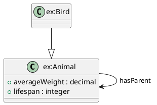

# RDF-Construct UML Module

## 🎯 Latest Update: PlantUML Syntax Fixes

The PlantUML renderer has been updated to generate correct, standards-compliant PlantUML syntax.

### Key Improvements
✅ **Quoted identifiers** - Class/object names with colons properly quoted  
✅ **Clean syntax** - No empty braces for classes without attributes  
✅ **CamelCase properties** - Technical identifiers follow conventions  
✅ **Human-readable labels** - Instance names stay readable  
✅ **Standards compliant** - Works with all PlantUML tools  

## 📦 What's Included

Complete RDF → PlantUML class diagram generator with:
- YAML-based context configuration
- Multiple selection strategies (roots, focus, selectors)
- Flexible property filtering modes
- Instance rendering with data values
- Hierarchy traversal with depth control
- Clean, valid PlantUML output

## 🚀 Quick Start

```bash
# List available contexts
poetry run rdf-construct contexts examples/uml_contexts.yml

# Generate diagrams
poerty run rdf-construct uml examples/animal_ontology.ttl examples/uml_contexts.yml

# Generate specific context
poetry run rdf-construct uml examples/organisation_ontology.ttl examples/uml_contexts.yml -c management
```

**Output**: Valid `.puml` files ready for PlantUML rendering.

## 📋 Example Output



## 📖 Documentation

- **[QUICKSTART.md](./docs/QUICKSTART.md)** - Get started in 5 minutes
- **[EXAMPLES_SHOWCASE.md](./docs/EXAMPLES_SHOWCASE.md)** - Visual examples
- **[UML_PIPELINE_SUMMARY.md](./docsUML_PIPELINE_SUMMARY.md)** - Technical details
- **[INDEX.md](./docs/INDEX.md)** - Complete overview

## 🎨 Generated Diagrams

All `.puml` files in `diagrams/` have been regenerated with correct syntax:
- `animal_ontology-*.puml` - Various animal taxonomy views
- `organisation_ontology-*.puml` - Management and people diagrams

Test them with:
- PlantUML online editor: https://www.plantuml.com/plantuml/
- VS Code PlantUML extension
- PlantUML CLI

## 🛠️ Usage

```bash
# List available contexts
poetry run rdf-construct contexts examples/uml_contexts.yml

# Generate specific diagram
poetry run rdf-construct uml ontology.ttl config.yml -c context_name

# Generate all diagrams
poetry run rdf-construct uml ontology.ttl config.yml
```

## 🔧 Create Custom Contexts

```yaml
contexts:
  my_view:
    description: "My custom diagram"
    root_classes:
      - ex:MyRootClass
    include_descendants: true
    properties:
      mode: domain_based
    include_instances: false
```

## ✅ Testing Status

- [x] Valid PlantUML syntax
- [x] Class hierarchy visualization
- [x] Property filtering (multiple modes)
- [x] Instance rendering with data
- [x] Namespace prefix handling
- [x] Works with PlantUML tools
