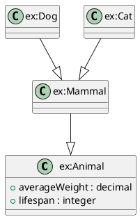

# Getting Started with rdf-construct

## What is rdf-construct?

**rdf-construct** is a toolkit for working with RDF ontologies. It helps you:

- **Reorder** RDF/Turtle files semantically (not just alphabetically)
- **Generate** UML class diagrams from ontologies
- **Visualize** semantic structures with flexible styling

Think of it as a Swiss Army knife for RDF—making ontologies more readable and easier to communicate.

## Quick Start (5 Minutes)

### Installation

```bash
# With Poetry (recommended)
cd rdf-construct
poetry install

# With pip
pip install rdf-construct

# From source
git clone https://github.com/aigora-de/rdf-construct.git
cd rdf-construct
pip install -e .
```

### Your First Diagram

```bash
# Generate UML diagrams from an example ontology
poetry run rdf-construct uml examples/animal_ontology.ttl examples/uml_contexts.yml

# Check the output
ls diagrams/
# animal_ontology-animal_taxonomy.puml
# animal_ontology-mammals_only.puml
# ... more diagrams
```

### View Your Diagrams

**Option 1: Online PlantUML Editor**
- Go to https://www.plantuml.com/plantuml/
- Copy/paste contents of a `.puml` file
- View rendered diagram

**Option 2: VS Code**
- Install "PlantUML" extension
- Open a `.puml` file
- Press `Alt+D` to preview

**Option 3: Command Line**
```bash
# Install PlantUML
brew install plantuml  # macOS
apt install plantuml   # Ubuntu

# Render diagram
plantuml diagrams/animal_ontology-animal_taxonomy.puml
# Creates .png file
```

## Basic Concepts

### Ontologies

RDF ontologies define classes, properties, and relationships. Example:

```turtle
@prefix ex: <http://example.org/animals#> .

ex:Animal a owl:Class .
ex:Mammal a owl:Class ;
    rdfs:subClassOf ex:Animal .
ex:Dog a owl:Class ;
    rdfs:subClassOf ex:Mammal .
```

### UML Diagrams

UML class diagrams show:
- **Classes** as boxes
- **Inheritance** as arrows with triangles
- **Properties** as attributes or associations

rdf-construct generates PlantUML syntax from RDF, which can then be rendered as images.

### Contexts

A **context** defines what to include in a diagram:

```yaml
contexts:
  animal_taxonomy:
    description: "Animal class hierarchy"
    root_classes:
      - ex:Animal
    include_descendants: true
    properties:
      mode: domain_based
```

## Common Tasks

### Generate All Diagrams

```bash
# Process all contexts in config
poetry run rdf-construct uml ontology.ttl config.yml
```

Output: Multiple `.puml` files in `diagrams/` directory.

### Generate Specific Diagram

```bash
# Just the "animal_taxonomy" context
poetry run rdf-construct uml examples/animal_ontology.ttl examples/uml_contexts.yml -c animal_taxonomy
```

### Custom Output Directory

```bash
# Put diagrams in "output/"
poetry run rdf-construct uml ontology.ttl config.yml -o output/
```

### List Available Contexts

```bash
# See what contexts are defined
poetry run rdf-construct contexts examples/uml_contexts.yml
```

Output:
```
Available UML contexts:

  animal_taxonomy
    Animal class hierarchy
    Roots: ex:Animal
    Includes descendants (unlimited)
    Properties: domain_based

  mammals_only
    Mammal classes
    Roots: ex:Mammal
    Includes descendants (depth=2)
    Properties: domain_based
```

## Understanding Contexts

### Root Classes Strategy

**Use When**: You want to show a hierarchy starting from specific concepts.

```yaml
animal_taxonomy:
  root_classes:
    - ex:Animal      # Start here
  include_descendants: true  # Include subclasses
  max_depth: null    # No limit (or set to 2, 3, etc.)
```

**Result**: Animal, Mammal, Dog, Cat, Bird, Eagle, Sparrow (full hierarchy).

### Focus Classes Strategy

**Use When**: You want to hand-pick specific classes.

```yaml
key_classes:
  focus_classes:
    - ex:Animal
    - ex:Dog
    - ex:Eagle
  include_descendants: false  # Just these
```

**Result**: Only Animal, Dog, and Eagle.

### Property Modes

**domain_based** (default): Show properties where domain matches selected classes.
```yaml
properties:
  mode: domain_based
```

**connected**: Show only properties between selected classes.
```yaml
properties:
  mode: connected
```

**explicit**: Hand-pick properties.
```yaml
properties:
  mode: explicit
  include:
    - ex:hasParent
    - ex:eats
```

**all**: Show everything.
```yaml
properties:
  mode: all
```

**none**: No properties.
```yaml
properties:
  mode: none
```

# Getting Started - Explicit Mode Addition

## Section to Add After "Understanding Contexts"

### Selection Modes

rdf-construct supports two modes for specifying diagram contents:

#### Default Mode (Automatic Selection)

Uses strategies to automatically select entities:
- **Root classes** with descendants
- **Focus classes** with optional expansion
- **Property modes** (domain_based, connected, etc.)

**Best for**: Standard hierarchies, complete branches, automatic property inclusion.

```yaml
animal_taxonomy:
  root_classes:
    - ex:Animal
  include_descendants: true
  properties:
    mode: domain_based
```

#### Explicit Mode (Manual Selection)

Directly list every class, property, and instance:

**Best for**: Cross-branch views, partial hierarchies, precise control.

```yaml
animal_care:
  mode: explicit
  classes:
    - ex:Animal
    - ex:Dog
    - ex:Eagle  # From different branch
  object_properties:
    - ex:hasParent
  datatype_properties:
    - ex:lifespan
```

**When to use which**:
- Default mode: Faster, good for complete hierarchies
- Explicit mode: Maximum control, cross-cutting views

### Example: Cross-Branch Diagram

Create a diagram with concepts from multiple hierarchies:

```yaml
contexts:
  cross_branch:
    description: "Concepts across taxonomy"
    mode: explicit
    
    classes:
      - ex:Mammal      # From one branch
      - ex:Dog         # Deeper in that branch
      - ex:Eagle       # From different branch
    
    object_properties:
      - ex:hasParent
      - ex:eats
    
    datatype_properties:
      - ex:lifespan
```

Generate:
```bash
poetry run rdf-construct uml examples/animal_ontology.ttl config.yml \
  -c cross_branch
```

Result: Clean diagram with just these concepts, ignoring other hierarchy members.

## Examples

### Example 1: Simple Class Hierarchy

**Ontology**: Animal → Mammal → Dog/Cat

**Context**:
```yaml
contexts:
  simple:
    root_classes:
      - ex:Animal
    include_descendants: true
    properties:
      mode: domain_based
```

**Output**:


### Example 2: With Instances

**Context**:
```yaml
contexts:
  with_instances:
    root_classes:
      - ex:Mammal
    include_descendants: true
    include_instances: true  # Show individuals
    properties:
      mode: domain_based
```

**Output**:
```plantuml
class "ex:Dog"

object "Fido" as "ex:Fido" {
  lifespan = 12
  averageWeight = 25.5
}

"ex:Fido" ..|> "ex:Dog"
```

### Example 3: Specific Properties

**Context**:
```yaml
contexts:
  relationships:
    focus_classes:
      - ex:Animal
    properties:
      mode: explicit
      include:
        - ex:hasParent
        - ex:eats
      exclude:
        - ex:scientificName
```

**Output**: Just Animal class with hasParent and eats properties shown.

## Tips & Tricks

### Start Simple

Begin with a basic context:
```yaml
contexts:
  basic:
    root_classes:
      - your:RootClass
    include_descendants: true
    properties:
      mode: domain_based
```

Generate and view. Then add complexity.

### Check Your Prefixes

RDFlib may assign different prefixes than expected. Check with:

```python
from rdflib import Graph
g = Graph().parse("your_ontology.ttl", format="turtle")
for pfx, ns in g.namespace_manager.namespaces():
    if pfx: print(f"{pfx}: {ns}")
```

Use the assigned prefix in your YAML config.

### Limit Depth for Large Hierarchies

If your diagram is too large:

```yaml
root_classes:
  - your:RootClass
include_descendants: true
max_depth: 2  # Only 2 levels deep
```

### Preview Quickly

Use the online PlantUML editor for fast iteration:
1. Generate `.puml` file
2. Copy contents
3. Paste at https://www.plantuml.com/plantuml/
4. Adjust config
5. Repeat

### Choosing Selection Mode

**Use Default Mode when:**
- Working with a single hierarchy
- Want all descendants of a root
- Property modes (domain_based, etc.) work well

**Use Explicit Mode when:**
- Need concepts from multiple hierarchies
- Want specific depth that's hard to specify
- Creating thematic/conceptual views
- Default modes include too much/too little

### Quick Decision Tree

```
Do you need classes from multiple hierarchies?
├─ Yes → Use explicit mode
└─ No
   └─ Do you want a complete hierarchy branch?
      ├─ Yes → Use default mode with root_classes
      └─ No → Consider explicit mode for precision
```

## Troubleshooting

### "Context not found"

**Problem**: `Error: Context 'my_context' not found`

**Solution**: Check spelling in YAML file. List available contexts:
```bash
poetry run rdf-construct contexts config.yml
```

### Empty Diagram

**Problem**: Generated `.puml` file has no classes.

**Possible Causes**:
1. **Wrong selector**: Check `root_classes` or `focus_classes` CURIEs
2. **Namespace mismatch**: Verify prefix in ontology
3. **No matching classes**: Check if classes exist in ontology

**Debug**:
```python
from rdflib import Graph
g = Graph().parse("ontology.ttl", format="turtle")
from rdflib.namespace import OWL, RDF
classes = list(g.subjects(RDF.type, OWL.Class))
print(f"Found {len(classes)} classes")
for cls in classes[:5]:
    print(f"  {g.namespace_manager.normalizeUri(cls)}")
```

### PlantUML Rendering Errors

**Problem**: PlantUML won't render `.puml` file.

**Solution**: Check for syntax errors. Our generated PlantUML should be valid, but if you edited it:
- Ensure class names with `:` are quoted
- Check matching braces
- Verify arrow syntax

### Layout Not as Expected

**Problem**: Hierarchy doesn't look right in rendered diagram.

**Explanation**: PlantUML's layout engine is heuristic-based. We provide hints (arrow direction), but can't guarantee exact layout.

**Try**:
- Different PlantUML themes
- Adjusting window size
- Manually tweaking `.puml` file (add `!pragma layout` directives)

### Explicit Mode: "Cannot expand CURIE"

**Problem**: `ValueError: Cannot expand CURIE: xyz:Something`

**Solution**: Check that prefix is defined in ontology:

```python
from rdflib import Graph
g = Graph().parse("ontology.ttl", format="turtle")
for pfx, ns in g.namespace_manager.namespaces():
    if pfx: print(f"{pfx}: {ns}")
```

Use the actual prefix assigned by rdflib.

## Next Steps

Now that you've got the basics, explore:

- **[UML Guide](UML_GUIDE.md)**: Complete feature documentation
- **[CLI Reference](CLI_REFERENCE.md)**: All commands and options
- **[Examples](../archive/examples/)**: More ontology examples

## Questions?

- **Issues**: https://github.com/aigora-de/rdf-construct/issues
- **Discussions**: https://github.com/aigora-de/rdf-construct/discussions

Happy diagramming!