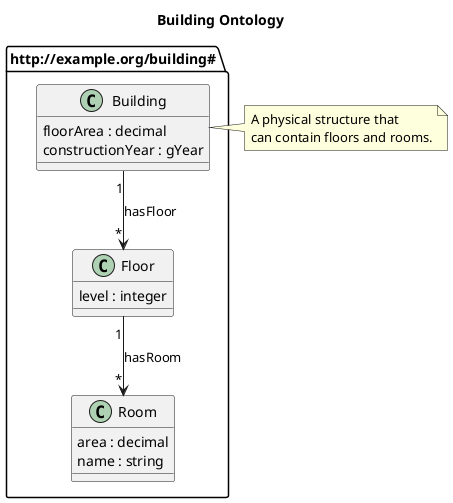

# PlantUML Import Guide

Convert PlantUML class diagrams to RDF/OWL ontologies with the `from-uml` command.

## Quick Start

```bash
# Basic conversion
rdf-construct from-uml design.puml

# Specify output and namespace
rdf-construct from-uml design.puml -o ontology.ttl -n http://example.org/building#

# Validate without generating
rdf-construct from-uml design.puml --validate
```

## Supported PlantUML Syntax

### Classes

```plantuml
' Simple class
class Building

' Class with attributes
class Building {
    floorArea : decimal
    constructionYear : gYear
    name : string
}

' Abstract class
abstract class Entity

' Class with stereotype
class Building <<persistent>>
```

### Relationships

```plantuml
' Inheritance (generates rdfs:subClassOf)
Building --|> Entity
Entity <|-- Building  ' Same meaning, reversed arrow

' Association (generates owl:ObjectProperty)
Building --> Floor : hasFloor

' With cardinalities (preserved as comments)
Building "1" --> "*" Floor : hasFloor

' Aggregation and composition
Building o-- Room : contains
Building *-- Foundation : hasFoundation
```

### Packages and Namespaces

```plantuml
' Package with explicit namespace URI
package "http://example.org/building#" as bld {
    class Building
    class Floor
}

' Simple package (generates namespace from name)
package core {
    class Entity
}
```

### Notes and Comments

```plantuml
' Single-line note
note right of Building : A physical structure

' Multi-line note
note right of Building
    A physical structure
    that can be occupied.
end note
```

Notes attached to classes become `rdfs:comment` in the generated ontology.

## RDF Mapping

### Classes

| PlantUML | RDF |
|----------|-----|
| `class Building` | `bld:Building rdf:type owl:Class` |
| `abstract class Entity` | `bld:Entity rdf:type owl:Class` |
| Note attached to class | `rdfs:comment` |

### Attributes

Attributes become `owl:DatatypeProperty` with domain set to the containing class:

| PlantUML | RDF |
|----------|-----|
| `floorArea : decimal` | `bld:floorArea rdf:type owl:DatatypeProperty ; rdfs:domain bld:Building ; rdfs:range xsd:decimal` |

### Supported Datatypes

| PlantUML Type | XSD Type |
|---------------|----------|
| `string`, `str`, `text` | `xsd:string` |
| `integer`, `int` | `xsd:integer` |
| `decimal`, `float`, `double` | `xsd:decimal`, `xsd:float`, `xsd:double` |
| `boolean`, `bool` | `xsd:boolean` |
| `date`, `datetime`, `time` | `xsd:date`, `xsd:dateTime`, `xsd:time` |
| `gYear`, `gYearMonth` | `xsd:gYear`, `xsd:gYearMonth` |
| `uri`, `anyURI`, `url` | `xsd:anyURI` |

### Relationships

| PlantUML | RDF |
|----------|-----|
| `A --\|> B` | `A rdfs:subClassOf B` |
| `A --> B : label` | `label rdf:type owl:ObjectProperty ; rdfs:domain A ; rdfs:range B` |

## CLI Reference

```bash
rdf-construct from-uml [OPTIONS] SOURCE
```

### Arguments

| Argument | Description |
|----------|-------------|
| `SOURCE` | PlantUML file (.puml or .plantuml) |

### Options

| Option | Description |
|--------|-------------|
| `-o, --output PATH` | Output file path (default: source with .ttl extension) |
| `-f, --format FORMAT` | Output format: turtle, xml, jsonld, nt (default: turtle) |
| `-n, --namespace URI` | Default namespace URI for the ontology |
| `-C, --config PATH` | Path to YAML configuration file |
| `-m, --merge PATH` | Existing ontology file to merge with |
| `-v, --validate` | Validate only, don't generate output |
| `--strict` | Treat warnings as errors |
| `-l, --language TAG` | Language tag for labels/comments (default: en) |
| `--no-labels` | Don't auto-generate rdfs:label triples |

### Exit Codes

| Code | Meaning |
|------|---------|
| 0 | Success |
| 1 | Validation warnings (with --strict) |
| 2 | Parse or validation errors |

## Configuration File

Create a YAML configuration file for advanced control:

```yaml
# puml-import.yml

# Default namespace for entities without explicit package
default_namespace: "http://example.org/building#"

# Language tag for labels and comments
language: "en"

# Automatically generate rdfs:label from entity names
generate_labels: true

# Convert camelCase names to readable labels
# e.g., 'floorArea' -> 'floor area'
camel_to_label: true

# Map PlantUML packages to RDF namespaces
namespace_mappings:
  - package: "building"
    namespace_uri: "http://example.org/building#"
    prefix: "bld"
  - package: "core"
    namespace_uri: "http://example.org/core#"
    prefix: "core"

# Custom datatype mappings
datatype_mappings:
  Money: "xsd:decimal"
  Percentage: "xsd:decimal"

# Preferred prefix ordering in output
prefix_order:
  - ""
  - "owl"
  - "rdfs"
  - "xsd"

# URIs to include as owl:imports
ontology_imports:
  - "http://example.org/core"
```

Use with:

```bash
rdf-construct from-uml design.puml -C puml-import.yml
```

## Merging with Existing Ontologies

The `--merge` option allows combining generated RDF with an existing ontology:

```bash
rdf-construct from-uml design.puml --merge existing.ttl -o merged.ttl
```

### Merge Behaviour

- **New entities** are added
- **Existing annotations** (comments, labels) are preserved
- **Authoritative predicates** (subClassOf, domain, range) from PlantUML take precedence
- **Conflicts** are reported but existing content wins by default

This enables iterative workflows:
1. Design structure in PlantUML
2. Generate initial ontology
3. Add manual annotations
4. Update PlantUML and re-merge

## Validation

Run validation without generating output:

```bash
rdf-construct from-uml design.puml --validate
```

### Checks Performed

**Model Validation:**
- Duplicate class names
- Relationships reference existing classes
- Inheritance cycles
- Unknown datatypes

**RDF Validation:**
- Classes properly typed
- Properties have domain/range
- No dangling references

### Strict Mode

Treat warnings as errors for CI pipelines:

```bash
rdf-construct from-uml design.puml --validate --strict
```

## Examples

### Basic Building Ontology

**Input** (`building.puml`):



**Command:**

```bash
rdf-construct from-uml building.puml -o building.ttl
```

**Output** (`building.ttl`):

```turtle
@prefix bld: <http://example.org/building#> .
@prefix owl: <http://www.w3.org/2002/07/owl#> .
@prefix rdfs: <http://www.w3.org/2000/01/rdf-schema#> .
@prefix xsd: <http://www.w3.org/2001/XMLSchema#> .

<http://example.org/building> a owl:Ontology ;
    rdfs:label "Building Ontology"@en .

bld:Building a owl:Class ;
    rdfs:label "building"@en ;
    rdfs:comment "A physical structure that can contain floors and rooms."@en .

bld:Floor a owl:Class ;
    rdfs:label "floor"@en .

bld:Room a owl:Class ;
    rdfs:label "room"@en .

bld:floorArea a owl:DatatypeProperty ;
    rdfs:domain bld:Building ;
    rdfs:range xsd:decimal ;
    rdfs:label "floor area"@en .

bld:constructionYear a owl:DatatypeProperty ;
    rdfs:domain bld:Building ;
    rdfs:range xsd:gYear ;
    rdfs:label "construction year"@en .

bld:level a owl:DatatypeProperty ;
    rdfs:domain bld:Floor ;
    rdfs:range xsd:integer ;
    rdfs:label "level"@en .

bld:area a owl:DatatypeProperty ;
    rdfs:domain bld:Room ;
    rdfs:range xsd:decimal ;
    rdfs:label "area"@en .

bld:name a owl:DatatypeProperty ;
    rdfs:domain bld:Room ;
    rdfs:range xsd:string ;
    rdfs:label "name"@en .

bld:hasFloor a owl:ObjectProperty ;
    rdfs:domain bld:Building ;
    rdfs:range bld:Floor ;
    rdfs:label "has floor"@en .

bld:hasRoom a owl:ObjectProperty ;
    rdfs:domain bld:Floor ;
    rdfs:range bld:Room ;
    rdfs:label "has room"@en .
```

## Unsupported Syntax

The following PlantUML features are not currently supported:

- Interface declarations (`interface`)
- Enum declarations (`enum`)
- Method declarations in classes
- Composition/aggregation semantic distinction (treated as associations)
- Generic types (`List<String>`)
- Constraint expressions in attributes
- Sequence diagrams, activity diagrams, etc.

## Tips

### Label Generation

By default, camelCase names are converted to readable labels:
- `floorArea` → "floor area"
- `hasBuilding` → "has building"

Disable with `--no-labels` or configure in YAML.

### Round-Trip Workflow

For ongoing development:

1. Start with PlantUML diagram
2. Generate initial RDF: `rdf-construct from-uml design.puml`
3. Add detailed annotations manually
4. Update PlantUML and merge: `rdf-construct from-uml design.puml --merge ontology.ttl`

### CI Integration

Add to your CI pipeline:

```yaml
# .github/workflows/ontology.yml
- name: Validate PlantUML
  run: rdf-construct from-uml design.puml --validate --strict

- name: Generate ontology
  run: rdf-construct from-uml design.puml -o ontology.ttl
```
