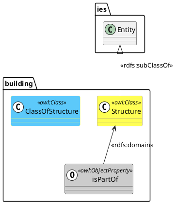
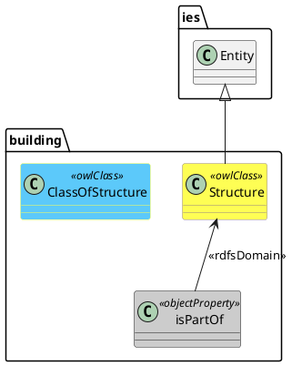

# ODM RDF Profile Rendering Mode

## Overview

The ODM (Ontology Definition Metamodel) rendering mode generates PlantUML class diagrams that comply with the OMG ODM 1.1 specification for representing RDF and OWL ontologies in UML.

This mode is useful when:
- Interoperability with standard UML tools is required
- You need to exchange diagrams with teams using ODM-compliant tools (e.g., Sparx Enterprise Architect, MagicDraw)
- Standards compliance is a project requirement

## Usage

```bash
# Basic ODM mode
poetry run rdf-construct uml ontology.ttl contexts.yml --rendering-mode odm

# Short form
poetry run rdf-construct uml ontology.ttl contexts.yml -r odm

# With styling and layout
poetry run rdf-construct uml ontology.ttl contexts.yml -r odm \
    --style-config examples/ies_colour_palette.yml --style ies_full \
    --layout-config examples/uml_layouts.yml --layout hierarchy
```

## Stereotype Comparison

### Classes

| RDF/OWL Type | Default Mode | ODM Mode |
|--------------|--------------|----------|
| `owl:Class` | `<< (C, #FFFFFF) owl:Class >>` | `<<owlClass>>` |
| `rdfs:Class` | `<< (C, #FFFFFF) rdfs:Class >>` | `<<rdfsClass>>` |
| `owl:Restriction` | `<< (C, #FFFFFF) owl:Restriction >>` | `<<restriction>>` |
| `rdfs:Datatype` | `<< (C, #FFFFFF) rdfs:Datatype >>` | `<<rdfsDatatype>>` |

### Properties

| RDF/OWL Type | Default Mode | ODM Mode |
|--------------|--------------|----------|
| `owl:ObjectProperty` | `<< (O, #FFFFFF) owl:ObjectProperty >>` | `<<objectProperty>>` |
| `owl:DatatypeProperty` | `<< (D, #FFFFFF) owl:DatatypeProperty >>` | `<<datatypeProperty>>` |
| `owl:AnnotationProperty` | `<< (A, #FFFFFF) owl:AnnotationProperty >>` | `<<annotationProperty>>` |
| `rdf:Property` | `<< (P, #FFFFFF) rdf:Property >>` | `<<rdfProperty>>` |

### Property Characteristics

ODM mode includes property characteristics in the stereotype:

```plantuml
' A functional, symmetric object property
class ex.relatedTo <<objectProperty, functional, symmetric>>
```

### Individuals

| Entity Type | Default Mode | ODM Mode |
|-------------|--------------|----------|
| Named Individual | `<< (I, #FFFFFF) ies:Entity >>` | `<<individual: ies:Entity>>` |
| Multiple Types | `<< (I, #FFFFFF) building:Structure, ies:Asset >>` | `<<individual: building:Structure, ies:Asset>>` |

### Relationships

| Relationship | Default Mode | ODM Mode |
|--------------|--------------|----------|
| `rdfs:subClassOf` | `A -u-\|> B : <<rdfs:subClassOf>>` | `A -u-\|> B` |
| `rdf:type` | `inst -u-[#FF0000]-> cls : <<rdf:type>>` | `inst -u-[#FF0000]-> cls : <<rdfType>>` |
| `rdfs:domain` | `prop -u-> cls : <<rdfs:domain>>` | `prop -u-> cls : <<rdfsDomain>>` |
| `rdfs:range` | `prop -u-> cls : <<rdfs:range>>` | `prop -u-> cls : <<rdfsRange>>` |

## Example Output

### Default Mode



### ODM Mode



## ODM Stereotype Reference

### Class Stereotypes

| Stereotype | Maps To |
|------------|---------|
| `<<owlClass>>` | `owl:Class` |
| `<<rdfsClass>>` | `rdfs:Class` |
| `<<restriction>>` | `owl:Restriction` |
| `<<rdfsDatatype>>` | `rdfs:Datatype` |
| `<<owlOntology>>` | `owl:Ontology` |

### Property Stereotypes

| Stereotype | Maps To |
|------------|---------|
| `<<objectProperty>>` | `owl:ObjectProperty` |
| `<<datatypeProperty>>` | `owl:DatatypeProperty` |
| `<<annotationProperty>>` | `owl:AnnotationProperty` |
| `<<ontologyProperty>>` | `owl:OntologyProperty` |
| `<<rdfProperty>>` | `rdf:Property` |

### Property Characteristic Stereotypes

These can be combined with the primary property stereotype:

| Stereotype | Maps To |
|------------|---------|
| `<<functional>>` | `owl:FunctionalProperty` |
| `<<inverseFunctional>>` | `owl:InverseFunctionalProperty` |
| `<<symmetric>>` | `owl:SymmetricProperty` |
| `<<transitive>>` | `owl:TransitiveProperty` |
| `<<reflexive>>` | `owl:ReflexiveProperty` |
| `<<irreflexive>>` | `owl:IrreflexiveProperty` |
| `<<asymmetric>>` | `owl:AsymmetricProperty` |

### Relationship Stereotypes

| Stereotype | Maps To |
|------------|---------|
| `<<rdfsSubClassOf>>` | `rdfs:subClassOf` |
| `<<rdfsSubPropertyOf>>` | `rdfs:subPropertyOf` |
| `<<rdfType>>` | `rdf:type` |
| `<<rdfsDomain>>` | `rdfs:domain` |
| `<<rdfsRange>>` | `rdfs:range` |
| `<<owlEquivalentClass>>` | `owl:equivalentClass` |
| `<<owlDisjointWith>>` | `owl:disjointWith` |
| `<<owlInverseOf>>` | `owl:inverseOf` |

## Styling with ODM Mode

ODM mode fully supports the existing styling system, including the **IES colour palette**. Colours, arrow styles, and layout directives work identically to default mode.

### Using IES Colour Palette

```bash
# ODM mode with full IES colour scheme
poetry run rdf-construct uml building.ttl contexts.yml -r odm \
    --style-config examples/ies_colour_palette.yml --style ies_full \
    --layout-config examples/uml_layouts.yml --layout hierarchy

# ODM mode with simplified IES colours
poetry run rdf-construct uml ontology.ttl contexts.yml -r odm \
    --style-config examples/ies_colour_palette.yml --style ies_core

# ODM mode with metaclass-focused IES scheme
poetry run rdf-construct uml ontology.ttl contexts.yml -r odm \
    --style-config examples/ies_colour_palette.yml --style ies_metaclass
```

### IES Colour Palette Features in ODM Mode

The IES colour palette provides:

- **Class hierarchy colours**: Entity (yellow), State (gold), Event (pink), PeriodOfTime (orange)
- **Metaclass colours**: ClassOfElement, ClassOfEntity, etc. (cyan tones)
- **Second-order metaclasses**: ClassOfClassOf... (lighter cyan)
- **Instance styling**: Black fill with text colour inherited from class hierarchy
- **Property styling**: Grey for ObjectProperty and DatatypeProperty
- **Arrow colours**: Configurable colours for rdf:type, subclass, and other relationships

All these features work seamlessly with ODM stereotypes.

### Example: IES Ontology with ODM Stereotypes

```plantuml
@startuml

' ODM RDF Profile compliant diagram
' Generated by rdf-construct

class building.Structure <<owlClass>> #back:FEFE54;line:968584
class building.ClassOfStructure <<owlClass>> #back:5CC9FA;line:FEFE54
class building.MyBuilding <<individual: building:Structure>> #back:000000;line:000000;text:FEFE54

class building.isPartOf <<objectProperty>> #back:CCCCCC;line:666666

building.Structure -u-|> ies.Entity
building.ClassOfStructure -u-|> ies.ClassOfEntity
building.MyBuilding -u-[#FF0000]-> building.Structure : <<rdfType>>

@enduml
```

## When to Use Each Mode

### Use Default Mode When:
- Working within your own project/team
- You prefer the visual indicators (C, O, D, A, I) for quick type identification
- You don't need to exchange diagrams with external tools
- You want the full QName in stereotypes (e.g., `owl:Class`)

### Use ODM Mode When:
- Exchanging diagrams with teams using ODM-compliant UML tools
- Standards compliance is required
- Importing diagrams into Enterprise Architect, MagicDraw, or similar tools
- Creating documentation for standards bodies or formal specifications

## References

- [OMG ODM 1.1 Specification](https://www.omg.org/spec/ODM/1.1/)
- [W3C OWL UML Concrete Syntax](https://www.w3.org/2007/OWL/wiki/UML_Concrete_Syntax)
- [Sparx Enterprise Architect ODM Support](https://sparxsystems.com/enterprise_architect_user_guide/16.1/modeling_languages/mdg_technology_for_odm.html)